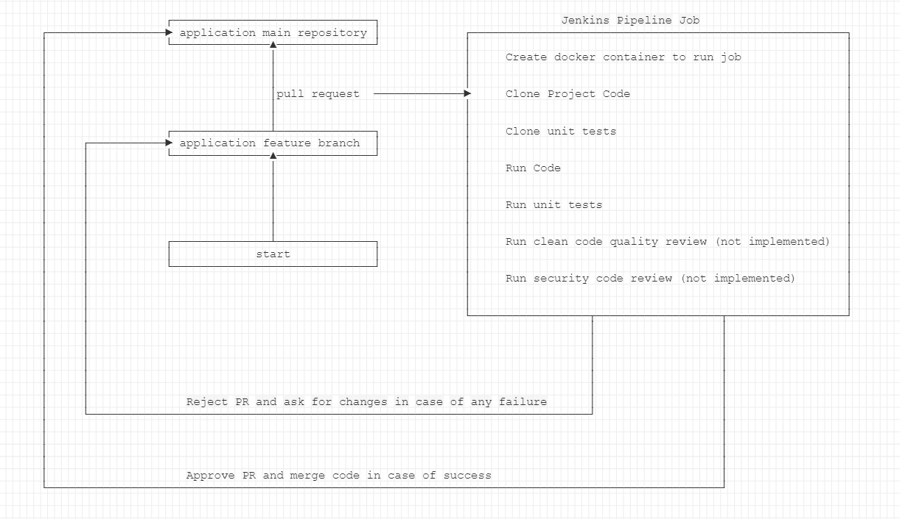

This repository contains the following stuff:
1. python_course - homeworks from the DevOps course including:
    - Bash
    - Python
    - AWS
    - Docker
    - Kubernetes
2. project - project sources from the DevOps course including:
    - Project Name: Automated CI/CD for pull requests
    - Project details: once pull request is opened to main branch, the following steps will be executed via Jenkins pipeline job:
      - Docker container is created to run the job
      - Project code is cloned from the github
      - Project unit tests are cloned from the github
      - Application code is run and checked
      - Application unit tests are run and checked
      - Application clean code quality review are run and checked (not implemented)
      - Application security code review are run and checked (not implemented)
      - In case of success:
        - Add successful comment to PR via github API
        - Approve PR via github API
        - Merge PR to main branch via github API
      - In case of failure:
        - Add failure comment to PR via github API
        - Reject PR and Request changes via github API
    - Steps done to run the project:
      - EC2 is created in order to install Jenkins instance.
      - Dockerized Jenkins is installed under EC2. Follow the file: project/jenkins/docker-compose.yaml
      - The following jenkins plugins are installed in order to catch pull requests (open and reopen):
        - GitHub Integration
      - Github webhook is created to trigger jenkins api once pull request is created.
        - Example for Payload URL: http://3.81.229.45:8080/github-webhook/
        - Choose the radio button: Let me select individual events
        - Select the checkbox: Pull requests
      - Jenkins pipeline is created which implements the automated CI/CD. Follow the file: project/jenkins/Jenkinsfile
      - Once pull request is created or reopened to main branch the github webhook will trigger the jenkins pipeline.
    - Project flow chart:
      
